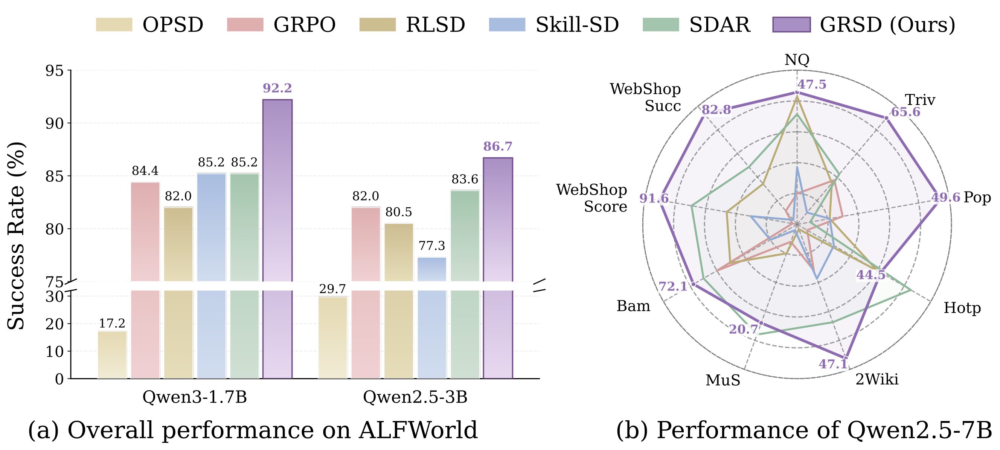

<h1 align="center">Group-Reflective Self-Distillation for Agentic Reinforcement Learning</h1>

GRSD learns fine-grained credit from the policy's own verified experience. For
each prompt, the policy reflects on every rollout, contrasts successful and
failed reflections into prompt-specific DO/AVOID guidance, and uses that
guidance as privileged context for turn-level self-distillation. Privileged
guidance is used only during training; inference requires only the task prompt.

<div align="center">
  
  <br>
  <em>GRSD constructs policy-native, outcome-discriminative guidance and turns it into bounded turn-level advantage modulation.</em>
</div>

## Method

GRSD has three connected components:

1. **Policy-native self-reflection.** The rollout policy identifies
   outcome-critical turns in each verified trajectory and distills behaviors
   to reinforce or avoid. A fixed rubric judge can supply the scalar reflection
   reward used by the auxiliary reflection objective; it never writes or edits
   reflection content.
2. **Group-level guidance construction.** A stop-gradient policy snapshot
   contrasts reflections from successful and failed rollouts of the same
   prompt and synthesizes a compact DO/AVOID prior.
3. **Turn-level self-distillation.** The same sampled actions are evaluated
   with and without the privileged prior. Their likelihood gap modulates the
   outcome-derived GRPO advantage without changing its verifier-determined
   direction.

The policy-native implementation is the official **GRSD** method. Its internal
entry point remains `verl.trainer.main_grsd_reflect` for compatibility with
existing checkpoints. `verl.trainer.main_grsd`, where an external model writes
the reflections and guidance, is retained only as an ablation.

## Results

GRSD is evaluated on ALFWorld, Search-based QA, and WebShop with
Qwen3-1.7B, Qwen2.5-3B-Instruct, and Qwen2.5-7B-Instruct.

<div align="center">
  
</div>

| Backbone | ALFWorld success | Search QA average | WebShop score / success |
| --- | ---: | ---: | ---: |
| Qwen3-1.7B | 92.2 | 43.8 | 84.5 / 66.4 |
| Qwen2.5-3B-Instruct | 86.7 | 46.2 | 86.9 / 76.5 |
| Qwen2.5-7B-Instruct | 92.2 | 50.5 | 91.6 / 82.8 |

<div align="center">
  
  <br>
  <em>Validation success rate and teacher-student gap on ALFWorld with Qwen3-1.7B.</em>
</div>

## Installation

Python 3.10 is recommended for a single environment that also supports
WebShop. Install a CUDA-compatible PyTorch build first, then install GRSD and
the rollout engine:

```bash
conda create -n grsd python=3.10 -y
conda activate grsd

pip install vllm==0.11.0
pip install flash-attn==2.7.4.post1 --no-build-isolation --no-cache-dir
pip install -e .
```

The official GRSD objective uses an OpenAI-compatible model only as a scalar
rubric judge during training:

```bash
export JUDGE_API_KEY=your_key
export JUDGE_API_BASE=https://your-openai-compatible-endpoint/v1
export JUDGE_MODEL=your_judge_model
```

Set `JUDGE_ENABLED=false` to disable the reflection reward and its auxiliary
loss while keeping policy-native reflection, guidance construction, and
turn-level self-distillation enabled.

## Data Preparation

All public scripts default to paths inside the repository:

```text
GRSD/
|-- models/                 # model checkpoints
|-- data/                   # task data and environment assets
`-- checkpoints/            # GRSD training outputs
```

Use `MODEL_ROOT`, `DATA_ROOT`, `MODEL_PATH`, `DATA_DIR`, and `PYTHON_BIN` to
override this layout. No machine-specific path is required.

### ALFWorld

```bash
pip install gymnasium==0.29.1 stable-baselines3==2.6.0 alfworld

export ALFWORLD_DATA="$PWD/data/alfworld"
alfworld-download -f
bash examples/data_preprocess/prepare_alfworld.sh
```

The preparation script creates the train/test Parquet schedules. The ALFWorld
download provides the actual games, logic files, and detector assets consumed
by the environment.

### Search-Based QA

Install the Search environment in the training environment:

```bash
pip install -e agent_system/environments/env_package/search/third_party
pip install gym==0.26.2
```

The retriever is best run in a separate Python 3.10 environment with PyTorch,
`transformers`, `datasets`, `pyserini`, `faiss-gpu`, `fastapi`, and `uvicorn`.
Prepare both the Search-R1 Parquet files and retrieval assets:

```bash
bash examples/data_preprocess/prepare_search.sh
bash examples/search/retriever/retrieval_launch.sh
```

Set `DOWNLOAD_RETRIEVER_ASSETS=false` when only the training Parquet files are
needed. `SEARCH_ASSET_ROOT`, `INDEX_FILE`, and `CORPUS_FILE` can point the
retrieval launcher at assets stored elsewhere.

### WebShop

WebShop requires Python 3.10, JDK 11 or newer, product JSON files, and a
Pyserini/Lucene index. Install its dependencies and prepare its assets with the
bundled environment scripts:

```bash
cd agent_system/environments/env_package/webshop/webshop
./setup.sh -d all
cd ../../../../../

bash examples/data_preprocess/prepare_webshop.sh

export WEBSHOP_DATA_DIR="$PWD/agent_system/environments/env_package/webshop/webshop/data"
export WEBSHOP_INDEX_DIR="$PWD/agent_system/environments/env_package/webshop/webshop/search_engine/indexes"
```

The training launcher expects large assets outside the tracked source tree by
default:

```text
data/webshop/
|-- data/
|   |-- items_shuffle_1000.json
|   |-- items_ins_v2_1000.json
|   `-- items_human_ins.json
|-- search_engine/indexes/
`-- jdk-11/
```

Override `WEBSHOP_DATA_DIR`, `WEBSHOP_INDEX_DIR`, or `WEBSHOP_JAVA_HOME` when
the setup output is stored elsewhere. The two exports above use the bundled
setup output directly; omit them when arranging assets under `data/webshop/`.

## Training

The repository provides the complete three-task by three-model launcher
matrix. Run all commands from the repository root.

| Task | Qwen2.5-3B-Instruct | Qwen2.5-7B-Instruct | Qwen3-1.7B |
| --- | --- | --- | --- |
| ALFWorld | `run_grsd_alfworld_qwen2.5_3b_local.sh` | `run_grsd_alfworld_qwen2.5_7b_local.sh` | `run_grsd_alfworld_qwen3_local.sh` |
| Search | `run_grsd_search_qwen2.5_3b_local.sh` | `run_grsd_search_qwen2.5_7b_local.sh` | `run_grsd_search_qwen3_local.sh` |
| WebShop | `run_grsd_webshop_qwen2.5_3b_local.sh` | `run_grsd_webshop_qwen2.5_7b_local.sh` | `run_grsd_webshop_qwen3_local.sh` |

Every filename in the table is relative to `examples/`. For example:

```bash
bash examples/run_grsd_alfworld_qwen3_local.sh
bash examples/run_grsd_search_qwen2.5_3b_local.sh
bash examples/run_grsd_webshop_qwen2.5_7b_local.sh
```

The paper configuration uses group size 8, self-distillation strength 0.5,
clip bound 0.2, and reflection-loss weight 0.01. Qwen3-1.7B ALFWorld runs for
600 policy updates; the other launcher combinations default to 240 updates.
All settings can be overridden through the environment or appended Hydra
arguments.

To run the external-reflection ablation instead of GRSD:

```bash
GRSD_VARIANT=external bash examples/run_grsd_alfworld_qwen3_local.sh
```

The legacy values `GRSD_VARIANT=reflect` and `GRSD_VARIANT=original` remain
accepted as aliases for `grsd` and `external`, respectively.

## Checkpoint Merging

Use `scripts/model_merger.py` to merge FSDP or Megatron checkpoints under
`./checkpoints/` into a Hugging Face model directory.

## Verification

Focused tests cover GRSD group gating, likelihood-gap normalization, bounded
advantage modulation, and scheduling:

```bash
python -m unittest tests.trainer.ppo.test_grsd_advantage
```

## Citation

The supplied manuscript is currently anonymous and does not contain public
paper metadata. The citation block should be updated with the final author
list and paper URL when those are public.

## Acknowledgements

This repository builds on
[veRL](https://github.com/volcengine/verl),
[verl-agent](https://github.com/langfengQ/verl-agent),
[ALFWorld](https://github.com/alfworld/alfworld),
[WebShop](https://github.com/princeton-nlp/WebShop), and
[Search-R1](https://github.com/PeterGriffinJin/Search-R1). We thank the authors
of these projects.
