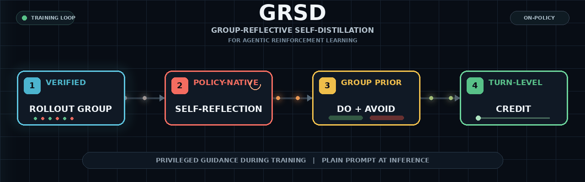
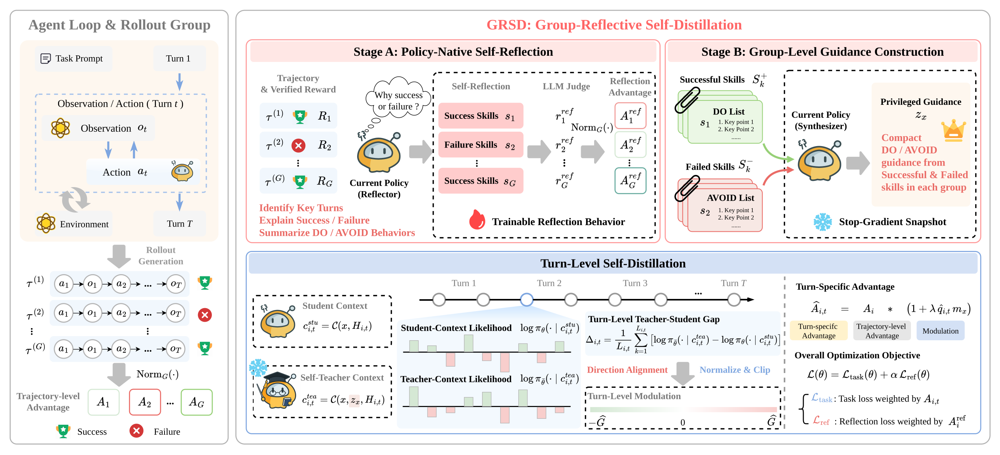
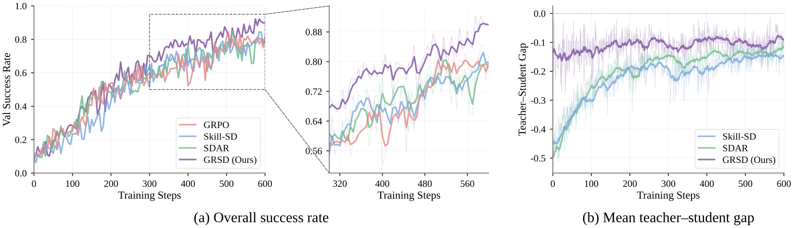
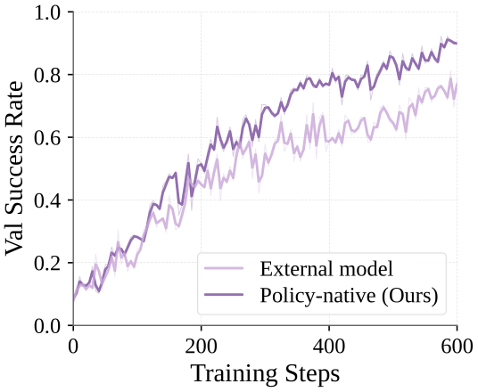
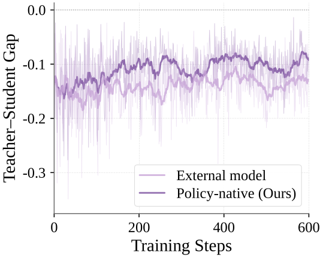
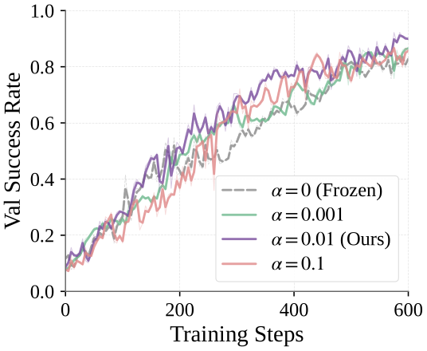
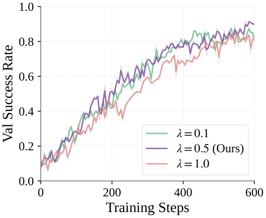
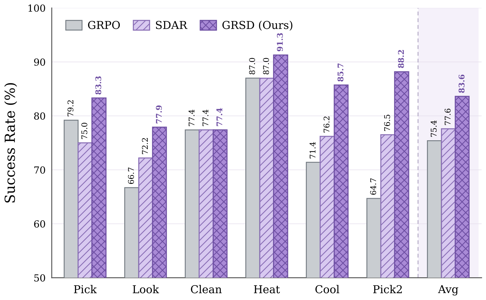

<div align="center">



<h1>Group-Reflective Self-Distillation for Agentic Reinforcement Learning</h1>

<p><strong>Policy-native reflection and turn-level credit assignment from verified on-policy experience</strong></p>

<p>
  <a href="LICENSE"></a>
  
  
  
  
</p>

<p><strong>Reflect on verified rollouts. Contrast success with failure. Distill the difference into turn-level credit.</strong></p>

<p>
  <a href="#overview">Overview</a> |
  <a href="#method">Method</a> |
  <a href="#results">Results</a> |
  <a href="#reproduce">Reproduce</a> |
  <a href="#launchers">Launchers</a>
</p>

</div>

## Overview

GRSD lets an agent learn fine-grained credit from its own verified experience. For each prompt, the policy reflects on every rollout, contrasts successful and failed reflections into a compact `DO / AVOID` prior, and uses that prior as privileged context for turn-level self-distillation.

Terminal rewards tell an agent whether a trajectory succeeded, but not which of its many decisions deserve credit. GRSD keeps the stable GRPO objective and adds a policy-native signal for that missing credit assignment.

<table align="center">
  <tr>
    <td align="center" width="25%"><strong>Policy-native</strong><br><sub>The policy writes its own reflections</sub></td>
    <td align="center" width="25%"><strong>Group-reflective</strong><br><sub>Success and failure are contrasted</sub></td>
    <td align="center" width="25%"><strong>Turn-level</strong><br><sub>Credit follows interaction structure</sub></td>
    <td align="center" width="25%"><strong>Inference-free</strong><br><sub>No privileged context at deployment</sub></td>
  </tr>
</table>

> [!IMPORTANT]
> **Official GRSD is policy-native.** The external model is only an optional scalar reflection judge; it never writes the reflection or group prior. The external-reflection implementation is retained solely as an ablation.

| Challenge | GRSD design |
| --- | --- |
| Sparse, trajectory-level reward | A self-teacher converts the trajectory advantage into a bounded, turn-level modulation. |
| Skills generated by a stronger external model | The policy reflects on its own verified trajectories, keeping guidance within its capability boundary. |
| A single rollout mixes useful and incidental behavior | A stop-gradient snapshot contrasts successful and failed rollouts for the same prompt. |
| Privileged training context can leak into deployment | The prior is detached from inference; the deployed agent receives only the original task prompt. |

## Method

<div align="center">
  
  <br>
  <sub><b>GRSD pipeline.</b> Privileged guidance is used during training only; inference uses the plain task prompt.</sub>
</div>

<br>

1. **Policy-native reflection.** For every verified rollout, the current policy identifies outcome-critical decisions and writes concrete behaviors to reinforce or avoid. An optional OpenAI-compatible endpoint supplies only a scalar rubric score for the reflection objective; it does not generate the reflection or the prior.
2. **Group-reflective prior.** A frozen snapshot contrasts the reflections of successful and failed rollouts from the same prompt and synthesizes a concise `DO / AVOID` prior.
3. **Turn-level self-distillation.** The sampled actions are scored with and without the privileged prior. The aligned likelihood gap changes the magnitude, but never the sign, of the verifier-derived GRPO advantage.

The policy-native implementation is the official **GRSD** variant and is selected by default. The legacy `verl.trainer.main_grsd` entry point is retained as the **external-reflection ablation** (`GRSD_VARIANT=external`) for comparisons and backward compatibility.

## Results

The paper evaluates three long-horizon environments and three instruction-tuned backbones. Values below are the reported per-environment averages; ALFWorld and SearchQA are percentages, while WebShop reports normalized score / success rate.

| Backbone | ALFWorld success | SearchQA accuracy | WebShop score / success |
| --- | ---: | ---: | ---: |
| Qwen3-1.7B | **92.2** | **43.8** | **84.5 / 66.4** |
| Qwen2.5-3B-Instruct | **86.7** | **46.2** | **86.9 / 76.5** |
| Qwen2.5-7B-Instruct | **92.2** | **50.5** | **91.6 / 82.8** |

### Training dynamics

On ALFWorld with Qwen3-1.7B, GRSD improves validation success while maintaining a useful teacher-student gap. The bounded turn-level modulation avoids the instability of unconstrained self-distillation.

<div align="center">
  
</div>

### Reflection strategy

Policy-native reflections are compared with the external summarizer used by the ablation entry point. Both success rate and the mean privileged-context gap favor the official GRSD construction.

<table>
  <tr>
    <td align="center"><br><sub>Overall success rate</sub></td>
    <td align="center"><br><sub>Mean teacher-student gap</sub></td>
  </tr>
</table>

### Hyperparameter sensitivity

The default settings use a moderate reflection-loss weight and self-distillation strength. The paper sweeps both to expose the stability / credit-shaping trade-off.

<table>
  <tr>
    <td align="center"><br><sub>Reflection-loss weight <code>alpha</code></sub></td>
    <td align="center"><br><sub>Self-distillation strength <code>lambda</code></sub></td>
  </tr>
</table>

### Cross-domain generalization

GRSD transfers beyond the in-domain ALFWorld training distribution and improves the Unseen task types, with particularly clear gains on Cool and Pick2.

<div align="center">
  
</div>

## Repository layout

```text
GRSD/
|-- agent_system/                 # ALFWorld, SearchQA, and WebShop environments
|-- examples/
|   |-- data_preprocess/           # task download and Parquet preparation
|   |-- search/retriever/          # local SearchQA retrieval service
|   `-- run_grsd_*_local.sh        # complete 3 task x 3 backbone matrix
|-- verl/trainer/ppo/              # GRSD trainers, reflection, and advantage logic
|-- skills/                        # task skill prompts and mappings
|-- docs/grsd/                     # figures used in the paper and this README
|-- scripts/                       # checkpoint conversion and merging utilities
`-- tests/                         # focused GRSD regression tests
```

## Reproduce

The public launchers use repository-relative defaults. Set `MODEL_ROOT`, `DATA_ROOT`, `MODEL_PATH`, `DATA_DIR`, `CHECKPOINT_DIR`, and `PYTHON_BIN` to adapt them to your machine; no absolute path from the development environment is required.

<details open>
<summary><strong>1. Install</strong></summary>

Python 3.10 is recommended. Install a CUDA-compatible PyTorch build first, then the rollout engine and this repository:

```bash
conda create -n grsd python=3.10 -y
conda activate grsd

pip install vllm==0.11.0
pip install flash-attn==2.7.4.post1 --no-build-isolation --no-cache-dir
pip install -e .
```

The full dependency list is in [`requirements.txt`](requirements.txt). The task environments add their own requirements as described below.

</details>

<details>
<summary><strong>2. Prepare data and environments</strong></summary>

All preparation scripts are kept in this repository and write to `data/` by default.

**ALFWorld**

```bash
pip install gymnasium==0.29.1 stable-baselines3==2.6.0 alfworld
export ALFWORLD_DATA="$PWD/data/alfworld"
alfworld-download -f
bash examples/data_preprocess/prepare_alfworld.sh
```

**Search-based QA**

```bash
pip install -e agent_system/environments/env_package/search/third_party
pip install gym==0.26.2
bash examples/data_preprocess/prepare_search.sh
```

Run the retriever in a separate Python 3.10 environment with `transformers`, `datasets`, `pyserini`, `faiss-gpu`, `fastapi`, and `uvicorn`:

```bash
bash examples/search/retriever/retrieval_launch.sh
```

Set `DOWNLOAD_RETRIEVER_ASSETS=false` when the Parquet files are already present. Use `SEARCH_ASSET_ROOT`, `INDEX_FILE`, and `CORPUS_FILE` for a non-default asset location.

**WebShop**

WebShop requires Python 3.10, JDK 11+, product JSON files, and a Pyserini/Lucene index:

```bash
cd agent_system/environments/env_package/webshop/webshop
./setup.sh -d all
cd ../../../../../
bash examples/data_preprocess/prepare_webshop.sh
```

The launcher expects the setup output under `data/webshop/` by default. Override `WEBSHOP_DATA_DIR`, `WEBSHOP_INDEX_DIR`, or `WEBSHOP_JAVA_HOME` when assets are stored elsewhere.

</details>

<details open>
<summary><strong>3. Configure the optional reflection judge</strong></summary>

Official GRSD uses an OpenAI-compatible endpoint only to assign a scalar rubric score to policy-generated reflections during training:

```bash
export JUDGE_API_KEY=your_key
export JUDGE_API_BASE=https://your-openai-compatible-endpoint/v1
export JUDGE_MODEL=your_judge_model
```

Set `JUDGE_ENABLED=false` to remove the auxiliary reflection reward and loss while retaining policy-native reflection, group-prior construction, and turn-level self-distillation. Keep `WANDB_MODE=offline` (the default) for local runs.

</details>

<a id="launchers"></a>
## Launchers

There is one official GRSD launcher for every combination of the three tasks and three backbones. Each defaults to `GRSD_VARIANT=grsd` and can be overridden without editing the script.

| Task | Qwen2.5-3B-Instruct | Qwen2.5-7B-Instruct | Qwen3-1.7B |
| --- | --- | --- | --- |
| ALFWorld | [`run_grsd_alfworld_qwen2.5_3b_local.sh`](examples/run_grsd_alfworld_qwen2.5_3b_local.sh) | [`run_grsd_alfworld_qwen2.5_7b_local.sh`](examples/run_grsd_alfworld_qwen2.5_7b_local.sh) | [`run_grsd_alfworld_qwen3_local.sh`](examples/run_grsd_alfworld_qwen3_local.sh) |
| SearchQA | [`run_grsd_search_qwen2.5_3b_local.sh`](examples/run_grsd_search_qwen2.5_3b_local.sh) | [`run_grsd_search_qwen2.5_7b_local.sh`](examples/run_grsd_search_qwen2.5_7b_local.sh) | [`run_grsd_search_qwen3_local.sh`](examples/run_grsd_search_qwen3_local.sh) |
| WebShop | [`run_grsd_webshop_qwen2.5_3b_local.sh`](examples/run_grsd_webshop_qwen2.5_3b_local.sh) | [`run_grsd_webshop_qwen2.5_7b_local.sh`](examples/run_grsd_webshop_qwen2.5_7b_local.sh) | [`run_grsd_webshop_qwen3_local.sh`](examples/run_grsd_webshop_qwen3_local.sh) |

Run from the repository root, for example:

```bash
bash examples/run_grsd_alfworld_qwen3_local.sh
bash examples/run_grsd_search_qwen2.5_3b_local.sh
bash examples/run_grsd_webshop_qwen2.5_7b_local.sh
```

The paper defaults are group size 8, `GRSD_LAMBDA=0.5`, `GRSD_G_HAT_MAX=0.2`, `GRSD_ETA=0`, and `REFLECT_LOSS_COEF=0.01`. ALFWorld Qwen3-1.7B defaults to 600 policy updates; the other launchers default to 240. Every setting can be overridden with an environment variable or appended Hydra arguments.

To reproduce the external-reflection ablation:

```bash
GRSD_VARIANT=external bash examples/run_grsd_alfworld_qwen3_local.sh
```

`GRSD_VARIANT=reflect` and `GRSD_VARIANT=original` remain accepted as legacy aliases for `grsd` and `external`.

## Checkpoints and evaluation

Training outputs default to `checkpoints/`. Use [`scripts/model_merger.py`](scripts/model_merger.py) to merge FSDP or Megatron shards into a Hugging Face model directory. Evaluation uses the task-specific environment wrappers and the same plain prompt format used by training.

## Verification

Run the focused GRSD regression suite before a long GPU job:

```bash
python -m unittest tests.trainer.ppo.test_grsd_advantage
python -m compileall -q verl agent_system examples/data_preprocess
for script in examples/run_grsd_*local.sh examples/run_grsd_reflect_*local*.sh; do bash -n "$script"; done
```

The launchers also validate required data/model paths, CUDA visibility, and (when enabled) the judge or SearchQA retriever endpoint before starting Ray.

## Acknowledgements

GRSD builds on [veRL](https://github.com/volcengine/verl), [verl-agent](https://github.com/langfengQ/verl-agent), [ALFWorld](https://github.com/alfworld/alfworld), [WebShop](https://github.com/princeton-nlp/WebShop), and [Search-R1](https://github.com/PeterGriffinJin/Search-R1). We also acknowledge the public [SDAR](https://github.com/ZJU-REAL/SDAR) repository, which provided an important implementation reference for agentic self-distillation. We thank the authors and contributors of these projects.

<div align="center">
  <sub>Apache-2.0 | Research code | Training-time privileged context, inference-time plain prompts</sub>
</div>
